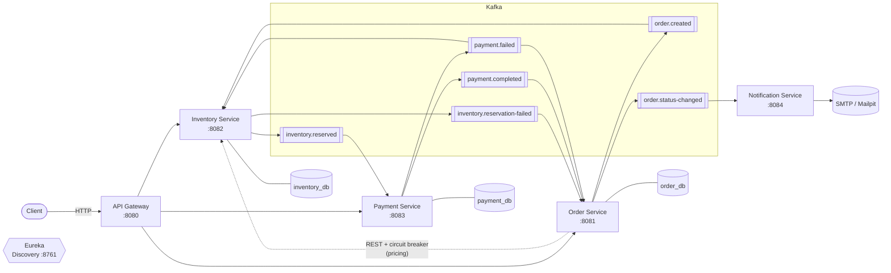
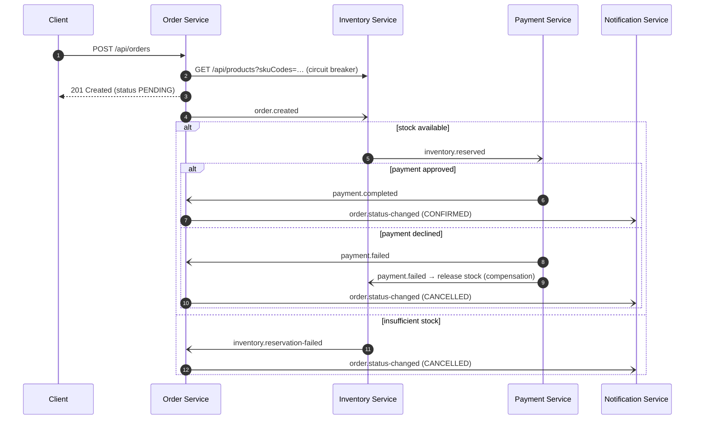

# E-Commerce Microservices

[](https://github.com/ebrahimmorkas/ecommerce-microservices/actions/workflows/ci.yml)


An event-driven e-commerce backend built with **Java 21, Spring Boot 3 and Spring Cloud**. Orders go through a
**choreography-based saga over Apache Kafka**: stock is reserved, the payment is charged, and the order is
confirmed. If any step fails, **compensating actions** undo the earlier steps.

The project shows patterns used in production microservice systems: database per service, an API gateway,
service discovery, circuit breakers, idempotent consumers, dead-letter topics, and integration tests against real
infrastructure with Testcontainers.

---

## Architecture



### Order saga



## Services

| Service | Port | Responsibility | Key tech |
|---|---|---|---|
| `api-gateway` | 8080 | Single entry point, routing, correlation IDs, aggregated Swagger UI | Spring Cloud Gateway (WebFlux) |
| `discovery-server` | 8761 | Service registry | Netflix Eureka |
| `order-service` | 8081 | Places orders, drives order state from saga events | JPA, Resilience4j, Kafka |
| `inventory-service` | 8082 | Product catalog, stock reservation and release | JPA, optimistic locking, Kafka |
| `payment-service` | 8083 | Charges customers through a payment-gateway port | JPA, Kafka |
| `notification-service` | 8084 | Emails customers when an order is confirmed or cancelled | Spring Mail, Kafka |
| `common-events` | – | Shared event contracts (plain Java records) | – |

## Engineering highlights

- **Saga with compensation:** a declined payment publishes `payment.failed`. Inventory then releases the reserved
  stock and the order is cancelled, so no distributed transaction or 2PC is needed.
- **Idempotent consumers:** Kafka delivers at least once. Stock reservations and payments are keyed by order
  number (unique constraints), so a redelivered event can never deduct stock or charge a customer twice.
- **Publish after commit:** domain events are relayed to Kafka with `@TransactionalEventListener`, so consumers
  never see an event for a change that was rolled back.
- **Resilience:** order→inventory calls go through a load-balanced `RestClient` wrapped in a
  **Resilience4j circuit breaker and time limiter**. If inventory is down, the order service fails fast with `503`
  instead of piling up threads.
- **Error handling on the consumer side:** retries with back-off (exponential for SMTP), then a
  **dead-letter topic**. Errors that can never succeed skip the retries.
- **Concurrency safety:** `@Version` optimistic locking on products prevents lost updates when concurrent orders
  reserve the same SKU.
- **Consistent API errors:** every service returns [RFC 9457](https://www.rfc-editor.org/rfc/rfc9457) `ProblemDetail`
  responses, with field-level validation errors.
- **Traceability:** the gateway stamps every request with an `X-Correlation-Id` that is propagated downstream.
- **Database per service** with versioned **Flyway** migrations (`ddl-auto: validate`).

## Tech stack

Java 21 · Spring Boot 3.5 · Spring Cloud 2025.0 (Gateway, Eureka, LoadBalancer, Circuit Breaker) · Spring Data JPA ·
PostgreSQL 16 · Flyway · Apache Kafka 3.9 (KRaft) · Resilience4j · springdoc-openapi · Lombok ·
JUnit 5 · Mockito · AssertJ · Testcontainers · WireMock · Awaitility · Docker · GitHub Actions

## Getting started

### Prerequisites
- Docker (with Compose v2) with at least **4 GB of memory** available to it (the full stack is 9 containers)
- JDK 21 (only if you want to build or run tests outside Docker; Maven is provided by the wrapper)

### Run the whole platform

```bash
docker compose up -d --build
```

Startup takes 1-2 minutes on a laptop while the JVMs boot and register with Eureka. Then open:

| URL | What |
|---|---|
| http://localhost:8080/swagger-ui.html | Aggregated API docs (all services) |
| http://localhost:8761 | Eureka dashboard |
| http://localhost:8090 | Kafka UI (topics, messages, consumer groups). Start it with `docker compose --profile tools up -d` |
| http://localhost:8025 | Mailpit, to read the emails sent to customers |

### Try the saga

```bash
# 1. Browse the catalog
curl http://localhost:8080/api/products

# 2. Place an order (payment approved -> CONFIRMED)
curl -i -X POST http://localhost:8080/api/orders \
  -H "Content-Type: application/json" \
  -d '{"customerEmail":"jane@example.com","items":[{"skuCode":"IPHONE-15","quantity":1}]}'

# 3. Check its status (use the orderNumber from the response)
curl http://localhost:8080/api/orders/{orderNumber}

# 4. Order above the $5,000 simulated card limit -> payment fails,
#    stock is released and the order is CANCELLED
curl -X POST http://localhost:8080/api/orders \
  -H "Content-Type: application/json" \
  -d '{"customerEmail":"jane@example.com","items":[{"skuCode":"MACBOOK-AIR","quantity":5}]}'

# 5. Not enough stock -> reservation fails -> CANCELLED
curl -X POST http://localhost:8080/api/orders \
  -H "Content-Type: application/json" \
  -d '{"customerEmail":"jane@example.com","items":[{"skuCode":"PIXEL-9","quantity":99}]}'
```

Open Mailpit (http://localhost:8025) to see the confirmation and cancellation emails.

Or run all of the scenarios above with assertions:

```bash
./scripts/smoke-test.sh
```

### Build and test

```bash
./mvnw verify          # unit + integration tests (Docker must be running for Testcontainers)
```

Integration tests start real **PostgreSQL** and **Kafka** containers. Nothing is mocked at the infrastructure
level, so the saga is tested end to end within each service.

## Project structure

```
ecommerce-microservices/
├── api-gateway/            # Spring Cloud Gateway
├── discovery-server/       # Eureka
├── common-events/          # Shared Kafka event records
├── order-service/
├── inventory-service/
├── payment-service/
├── notification-service/
├── docker/postgres/        # DB-per-service init script
├── docker-compose.yml      # Full local stack
├── Dockerfile              # Multi-stage, layered image for any service
└── .github/workflows/ci.yml
```

Each service follows the same layout: `web` (controllers), `service`, `domain` (entities with behavior),
`repository`, `messaging` (Kafka listeners and relays), `config`, `exception`.

## Design decisions and trade-offs

| Decision | Why | Trade-off / next step |
|---|---|---|
| Choreography saga | Services stay decoupled, and there is no central coordinator to scale or fail | The flow is spread across services. An orchestrator (e.g. a state machine) would be easier to follow as the flow grows |
| Publish after commit | Simple, and it avoids publishing rolled-back changes | A crash between commit and publish can lose an event. A **transactional outbox** (e.g. Debezium CDC) would close that gap |
| Synchronous pricing call | The customer gets immediate feedback on unknown SKUs and prices | Couples order placement to inventory availability. This is mitigated by the circuit breaker |
| Simulated payment gateway | Deterministic demos of both saga paths | A real provider plugs in behind the `PaymentGateway` port |

## Roadmap

- [ ] Transactional outbox pattern
- [ ] OAuth2 / JWT security at the gateway (Keycloak)
- [ ] Distributed tracing (Micrometer Tracing + Zipkin) and Prometheus/Grafana dashboards
- [ ] Kubernetes manifests / Helm chart

## License

[MIT](LICENSE)
